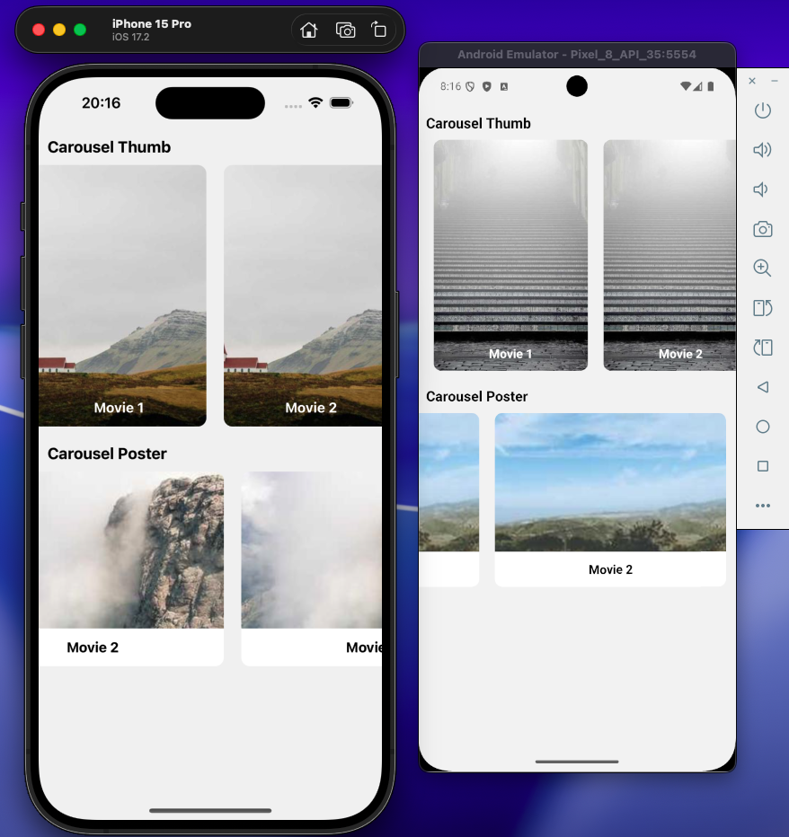

# Challenge Carrusel 🎠

Aplicación de React Native que muestra un carrusel de contenido multimedia con soporte para imágenes y videos.

## 📋 Requisitos Previos

- Node.js >= 20
- npm o Yarn
- Xcode (para iOS)
- Android Studio (para Android)
- CocoaPods (para iOS)

## 🚀 Instalación

### Paso 1: Clonar el repositorio

```sh
git clone <url-del-repositorio>
cd ChallegeCarrusel
```

### Paso 2: Configurar variables de entorno

Renombra el archivo `.env.example` a `.env` y configura las variables:

```sh
cp .env.example .env
```

Edita el archivo `.env` con los siguientes valores:

```env
API_BASE_URL=https://example.com/v1
MI_CODIGO_ACCESO=access_code_here
```

### Paso 3: Instalar dependencias

```sh
# Usando npm
npm install

# O usando Yarn
yarn install
```

#### Para iOS:

```sh
cd ios && pod install && cd ..
```

#### Para Android (solo en caso de error):

```sh
cd android && ./gradlew clean && cd ..
```

### Paso 4: Ejecutar la aplicación

```sh
# iOS
npx react-native run-ios
# o
yarn ios

# Android
npm react-native run-android
# o
yarn android
```

---

## 📱 Capturas de Pantalla

### App Preview



### Video Demo

🎬 [Ver video demo](https://drive.google.com/file/d/1MLoy2-b6BUAWyRyMn2RXXz9azXTVz6i8/view?usp=sharing)

---

## 🛠️ Tecnologías Utilizadas

- **React Native** 0.83.1 + **React** 19.2.0
- **Redux Toolkit** + **Redux Persist** (manejo de estado)
- **React Navigation** (navegación)
- **Axios** (cliente HTTP)
- **React Native Video** + **Orientation Locker** (reproducción de videos)
- **Fast Image** (carga optimizada de imágenes)
- **JavaScript ES6+**

---

## 🏗️ Arquitectura

El proyecto sigue los **principios SOLID** y una **arquitectura limpia (Clean Architecture)** con separación de capas: `domain`, `infrastructure` y `presentation`. Desarrollado con **JavaScript ES6+**.

---

## 🧪 Testing

Se implementaron tests unitarios utilizando Jest:

```sh
npm test
# o
yarn test
```

### Tests implementados:

- ✅ `__tests__/App.test.js` - Test general de la aplicación
- ✅ `src/core/utils/__tests__/jwt.test.js` - Tests de funciones JWT (`decodeToken`, `isTokenExpired`)

---

## 📝 Notas y Puntos de Mejora

1. **Imágenes:** No se utilizó la imagen de la API ya que la URL no existe. Se usó imágenes de [Lorem Picsum](https://picsum.photos/) como alternativa.

2. **Videos:** Cuando un registro no tiene video asociado, se navega a la pantalla de descripción. Si tiene video, se muestra en orientación horizontal (landscape).

3. **Orientación:** Al reproducir un video la pantalla cambia a horizontal. Al presionar "back", vuelve automáticamente a portrait.

4. **CLI:** Se utilizó el template de [@react-native-community/cli](https://github.com/react-native-community/cli) para la creación del proyecto.

---

## 📄 Licencia

Este proyecto es parte de un challenge técnico.
